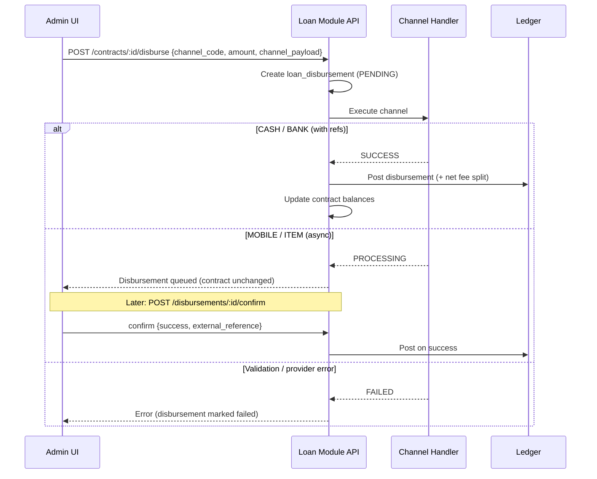

# Loan Disbursement Channels

## Overview

Disbursement is routed through a **channel catalog** (`disbursement_channels`). Each loan payout creates a `loan_disbursements` row with **status tracking**; only `SUCCESS` updates the contract balance, GL, and milk deduction.

## Flow



## Channel catalog

| Code | Type | Mode | Required payload |
|------|------|------|------------------|
| `CASH` | CASH | Immediate | — |
| `ITEM_PURCHASE` | ITEM | Async | `store_order_ref` |
| `MOBILE_MPESA` | MOBILE | Async (Daraja B2C) | `phone_number` |
| `MOBILE_DTB_MPESA` | MOBILE | Async (DTB/Astra + OTP) | `phone_number` |
| `MOBILE_AIRTEL` | MOBILE | Async (Airtel API) | `phone_number` |
| `MOBILE_EQUITEL` | MOBILE | Async (Jenga Finserve) | `phone_number` |
| `BANK_COOP` | BANK | Immediate* | `account_number`, `bank_reference` |
| `BANK_EQUITY` | BANK | Immediate* | `account_number`, `bank_reference` |
| `BANK_KCB` | BANK | Immediate* | `account_number`, `bank_reference` |
| `WALLET_MEMBER` | WALLET | Not implemented | — |

\*Bank channels record success once reference is supplied (manual transfer today). Future: bank API integration with async confirm.

## API

```
GET  /api/loan-module/disbursement-channels
GET  /api/loan-module/disbursement-channels/:id/config
PUT  /api/loan-module/disbursement-channels/:id/config
POST /api/loan-module/contracts/:id/disburse
POST /api/loan-module/disbursements/:id/confirm
GET  /api/loan-module/disbursements/:id/provider-status
```

## Provider configuration (`disbursement_channel_config`)

Each channel can store **provider credentials and settings** in the database as key-value rows. At execution time the API resolves settings in this order:

1. **Database** value for the channel (`disbursement_channel_config`)
2. **Environment** variable fallback (`.env` / container env)
3. **Built-in defaults** (e.g. sandbox API URLs)

| Storage | Purpose | Example |
|---------|---------|---------|
| `config_schema` on channel | Per-disbursement **payload** fields for UI | `phone_number` |
| `disbursement_channel_config` | **Provider setup** for the channel | `consumer_key`, `callback_url` |
| Request `channel_payload` | Per-payout runtime data | member phone at disburse time |

Admin UI: **Loans → Disbursement Channels → Edit → Provider Configuration**.

Provider templates (by `disbursement_channels.provider`):

| Provider | Keys |
|----------|------|
| `MPESA` | `consumer_key`, `consumer_secret`, `b2c_shortcode`, `initiator_*`, `cert_path`, callback URLs |
| `AIRTEL` | `client_id`, `client_secret`, `disbursement_pin`, `public_key_path`, `callback_url` |
| `EQUITY_JENGA` | `api_key`, `merchant_code`, `consumer_secret`, `private_key_path`, `source_account` |
| `DTB` | `remote_url`, `auth_url`, `auth_identity`, `tenant_password`, `withdrawal_callback_url` |

Secrets are masked in GET responses. PUT accepts `{ "items": [{ "key", "value" }] }`; empty `value` removes the DB override (falls back to env).

Migration: `deploy/loans/009_disbursement_channel_config.sql`


```json
{
  "channel_code": "BANK_COOP",
  "amount": 98000,
  "reference": "DISB-LN-821-001",
  "channel_payload": {
    "account_number": "0112345678",
    "bank_reference": "COOP-TXN-998877"
  },
  "post_to_gl": true,
  "create_milk_deduction": true
}
```

Legacy `method` field still works: `CASH`, `BANK`, `MOBILE_MONEY` map to default channels.

### Confirm (async channels / callbacks)

```json
{
  "success": true,
  "external_reference": "MPESA-ABC123XYZ",
  "post_to_gl": true,
  "create_milk_deduction": true
}
```

## Disbursement statuses

| Status | Meaning |
|--------|---------|
| `PENDING` | Created, not yet executed |
| `PROCESSING` | Sent to provider / awaiting fulfillment |
| `SUCCESS` | Funds delivered; contract updated |
| `FAILED` | Channel rejected or finalize error |
| `CANCELLED` | Manually cancelled (future) |

## Public callbacks

```
POST /api/mpesa-b2c-result
POST /api/mpesa-b2c-timeout
POST /api/airtel-disbursement-callback
POST /api/jenga-mobile-callback
POST /api/withdrawal-callback          # DTB/Astra
```

## Next implementations

1. **Item purchase** — link to store POS / goods issue module
2. **Member wallet** — credit savings/wallet ledger
3. **Bank APIs** — Co-op / Equity host-to-host with async confirm
