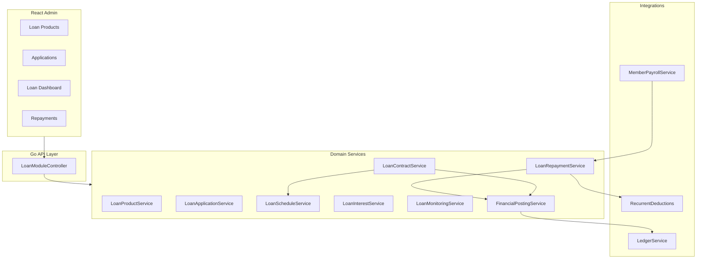
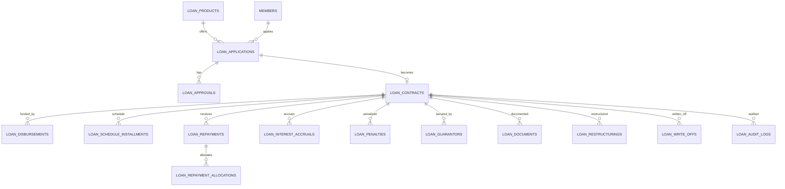
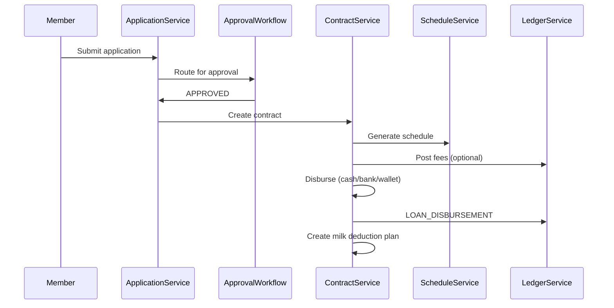
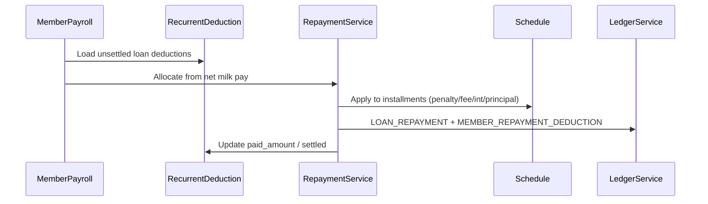

# eDairy Loan Management Module

Production-ready SACCO-style lending for dairy cooperatives. Integrates with Members, Finance/GL, Milk Payments, Savings, Shares, Cash/Bank, and Notifications.

## Architecture

## Entity Relationship (core)

## Business Workflows

### Application → Disbursement

### Milk Payment Deduction

## Application Statuses

| Status | Description |
|--------|-------------|
| DRAFT | Editable by member/staff |
| SUBMITTED | Awaiting review |
| UNDER_REVIEW | Credit assessment in progress |
| APPROVED | Approved, pending contract/disbursement |
| REJECTED | Declined with reason |
| CANCELLED | Withdrawn |
| DISBURSED | Contract created and funded |

## Contract Statuses

| Status | Description |
|--------|-------------|
| PENDING_DISBURSEMENT | Approved, not yet funded |
| ACTIVE | Performing loan |
| OVERDUE | Past due installments |
| RESTRUCTURED | Terms modified |
| SETTLED | Fully paid |
| WRITTEN_OFF | Bad debt write-off |
| CLOSED | Administrative closure |

## Interest Methods

| Method | Description |
|--------|-------------|
| FLAT | Total interest = P × rate × periods; equal installments |
| REDUCING_BALANCE | Interest on outstanding principal each period |
| EQUAL_INSTALLMENTS | Standard PMT amortization |
| INTEREST_ONLY | Interest each period; principal at maturity |
| BALLOON | Periodic interest/small principal; large final payment |

## Repayment Allocation Priority (default)

1. Penalties  
2. Fees (processing, insurance)  
3. Accrued interest  
4. Principal  

Configurable per product via `allocation_priority` JSON array.

## Double-Entry Posting Matrix

See [posting-matrix.yaml](./posting-matrix.yaml). All entries posted via `LedgerService` (immutable GL, reversals only).

| Event | Debit | Credit |
|-------|-------|--------|
| Loan disbursement | 1200 Member Loans | 1000 Cash at Bank |
| Loan repayment (cash) | 1000 Cash at Bank | 1200 Member Loans |
| Milk deduction | 2215 Member Payables | 1200 Member Loans |
| Processing fee (cash) | 1000 Cash | 4100 Loan Fee Income |
| Processing fee (capitalized) | 1200 Member Loans | 4100 Loan Fee Income |
| Interest accrual | 1200 Member Loans | 4010 Interest Income |
| Penalty charged | 1200 Member Loans | 4020 Penalty Income |
| Penalty waiver | 4020 Penalty Income | 1200 Member Loans |
| Write-off | 5105 Bad Debt Expense | 1200 Member Loans |
| Recovery after write-off | 1000 Cash | 5105 Bad Debt Expense |

## REST API Summary

Base path: `/api/loan-module`

| Method | Path | Description |
|--------|------|-------------|
| GET/POST | `/products` | Loan products CRUD |
| GET/PUT/DELETE | `/products/:id` | Single product |
| GET/POST | `/applications` | Applications |
| POST | `/applications/:id/submit` | Submit for review |
| POST | `/applications/:id/approve` | Approval step |
| POST | `/applications/:id/reject` | Reject |
| GET/POST | `/contracts` | Active loans |
| POST | `/contracts/:id/disburse` | Disburse funds |
| GET | `/contracts/:id/schedule` | Repayment schedule |
| POST | `/contracts/:id/repayments` | Manual repayment |
| GET | `/contracts/:id/statement` | Loan statement |
| POST | `/contracts/:id/settle` | Early settlement quote/execute |
| POST | `/contracts/:id/restructure` | Restructure |
| POST | `/contracts/:id/write-off` | Write-off |
| POST | `/interest/accrue` | Batch interest accrual |
| GET | `/reports/portfolio` | Portfolio summary |
| GET | `/reports/aging` | Aging report |
| GET | `/reports/par` | PAR / NPL metrics |

Full specification: [API.md](./API.md)

## Deployment

1. Run `001_loan_module_schema.sql` (or rely on `EnsureLoanSchema()` on API startup).
2. Seed posting rules from `posting-matrix.yaml` via finance seed or SQL.
3. Grant permissions: `loan-products.*`, `loan-applications.*`, `loan-contracts.*`, `loan-reports.view`.
4. Configure default loan products per dairy.

## Migration from Legacy

- Legacy `member_loans` / `loans` CRUD remains for backward compatibility.
- New SACCO workflows use `loan_contracts` and related tables.
- Optional data migration script maps approved legacy loans → contracts (future).

## Test Cases

See [TEST-CASES.md](./TEST-CASES.md) for unit, integration, and UAT scenarios.

## Administrator Guide

1. **Configure products** — set rates, limits, grace, fees, allocation priority.
2. **Approval workflow** — assign roles (credit, finance, manager, board).
3. **Disburse** — choose channel; GL posts automatically when `post_to_gl=true`.
4. **Milk recovery** — on disbursement a `recurrent_deduction` is created; payroll approval recovers automatically.
5. **Interest accrual** — schedule cron or manual `POST /loan-module/interest/accrue`.
6. **Monitoring** — use portfolio, aging, and PAR reports for board meetings.
